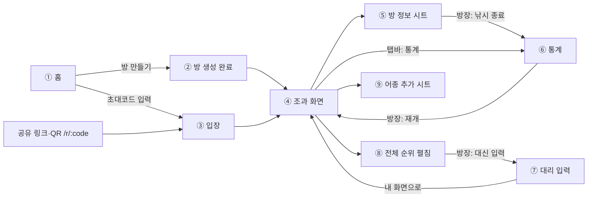

# 강태공(gangtaegong) 설계 문서

> **Summary**: 방 1개 = Durable Object 1개. 순수 도메인 규칙과 UseCase를 클라이언트·Worker가 **동일하게 실행**하고, Repository 구현만 바꿔 낙관적 업데이트와 서버 확정을 일치시키는 Clean Architecture 설계.
>
> **Project**: fishing-kang (강태공)
> **Version**: v0.1 (Design)
> **Author**: tawool
> **Date**: 2026-09-21
> **Status**: Draft
> **Planning Doc**: [gangtaegong.plan.md](../../01-plan/features/gangtaegong.plan.md)

### Pipeline References

| Phase | Document | Status |
|-------|----------|--------|
| Phase 1 | [Schema Definition](../../01-plan/schema.md) | ❌ 미작성 — 본 문서 §3이 사실상의 스키마 정의 (Do 전에 이관) |
| Phase 2 | [Coding Conventions](../../01-plan/conventions.md) | ❌ 미작성 — 본 문서 §10이 사실상의 컨벤션 (Do 전에 이관) |
| Phase 3 | Mockup | ✅ [디자인 캔버스](https://claude.ai/artifact/4acajiyND8wRCmFfMCmbtk) 아트보드 6개 + 본 문서 §5.4 명세 4종 |
| Phase 4 | API Spec | ✅ 본 문서 §4 |

---

## Context Anchor

> Plan 문서에서 복사. Design→Do 인계 시 전략 컨텍스트 유실 방지.

| Key | Value |
|-----|-------|
| **WHY** | 조과 집계가 기억·단톡방에 흩어져 실시간 경쟁 재미와 사후 기록이 모두 사라진다. |
| **WHO** | 함께 출조하는 지인 그룹 2~15명. 앱 설치·가입을 꺼리고, 한 달에 한두 번 쓰는 비개발자 사용자. 방을 주도하는 **방장 1명** + 일반 참여자. |
| **RISK** | 낚시터 통신 불량으로 탭이 증발하면 서비스 신뢰가 즉시 무너진다. 그 다음이 iOS 저장소 삭제로 인한 신원 유실. |
| **SUCCESS** | 필드 테스트(지인 2~3명, 실제 낚시터)에서 비행기 모드 on/off 왕복 후 **조과 유실 0건·중복 0건**, 온라인 상태 포디움 반영 1초 이내, Cloudflare 월 비용 0원. |
| **SCOPE** | M1 뼈대 → M2 메인 화면 → M3 통계·PWA → M4 필드 테스트. 1인 저녁 작업 기준 약 2주. |

---

## Design Anchor

> Pencil MCP 미사용. 디자인 토큰은 [디자인 초안 v0.2](https://app.notion.com/p/3e27ef63522981eea087d92787e3b89b) 확정값을 `src/presentation/client/styles/tokens.css`에 CSS 변수로 **고정**한다. 구현 중 임의 색상 추가 금지.

| Category | Tokens |
|----------|--------|
| **Colors** | `--sky:#9ED9F0` / `--sea:#2BA9C4` `--sea-2:#22A0BB` `--sea-3:#1A8DA8` / `--sand:#F7F2E7` / `--ink:#0B2A3C` / `--buoy:#C43E18` / `--gold:#E2A523` `--silver:#B8C3CA` `--bronze:#C07A3C` / `--marlin:#245C99` `--marlin-2:#1A4677` / `--proxy-bg:#FBE7C6` `--proxy-banner:#7A3A0C` |
| **Fish colors** | 우럭 `#4E5E66` / 광어 `#8A6A48` / 노래미 `#5E7A3A` / 쥐치 `#2F6F8A` — 그 외 어종은 이 4색을 이름 해시로 순환 배정 |
| **Typography** | 제목·숫자 **Black Han Sans** / 본문 **IBM Plex Sans KR** 400·500·700 (Google Fonts). 스케일: 40 / 28 / 20 / 16 / 14 / 12 |
| **Spacing** | 4px 그리드. 카드 패딩 16, 섹션 간격 24, 화면 좌우 거터 16 |
| **Radius** | 카드·버튼 `--r:14px`, 알약 999px, 시트 상단 20px |
| **Tone** | 맑은 낮, 무인도 근처 배낚시. 가볍고 경쾌한 레저. 이모지 아이콘 금지(선 아이콘/인라인 SVG) |
| **Layout** | 390px 기준 모바일 웹 1컬럼. 상단 하늘 헤더 고정 + 중앙 스크롤 + 하단 탭바. 어종 카드는 2열 그리드 |
| **Touch** | +1 버튼 **64px 풀폭**, 그 외 모든 터치 타깃 **≥44px**, −1은 카드 우상단 32px 원형(터치영역 44px, 시각크기 32px) |

---

## 1. Overview

### 1.1 Design Goals

1. **규칙 단일 출처(Single Source of Truth)** — 쿨다운 판정, −1 대상 선택, 공동 순위, 멱등 처리는 **오직 `domain/`에만** 존재한다. 클라이언트의 낙관적 예측과 DO의 확정 처리는 같은 함수를 호출한다.
2. **오프라인 우선** — 모든 쓰기 동작은 "로컬 확정 → Outbox 적재 → 전송 → ack 후 제거" 순서를 따른다. 네트워크는 **선택적 경로**이지 전제 조건이 아니다.
3. **방 단위 완결** — 상태·동기화·브로드캐스트·TTL 삭제가 전부 한 DO 안에서 끝난다. 방 간 공유 상태 0.
4. **무료 플랜 상주** — WebSocket Hibernation으로 유휴 과금을 0에 수렴시킨다.
5. **테스트 가능성** — DO나 브라우저를 띄우지 않고 `domain/`·`application/` 전체를 단위 테스트할 수 있다.

### 1.2 Design Principles

- **의존성 역전**: `application/`은 인터페이스(Port)에만 의존하고, DO SQLite·fetch·localStorage 같은 구현은 전부 `infrastructure/`에서 주입한다.
- **도메인은 순수**: `domain/`은 `Date.now()`, `crypto`, I/O를 직접 부르지 않는다. 시각과 ID는 인자로 받는다 → 테스트에서 시간 제어 가능.
- **이벤트 로그가 진실**: 카운트는 컬럼이 아니라 `catch_event`에서 파생한다. −1은 삭제가 아니라 `voided_at` 마킹이다.
- **서버는 멱등과 역할만**: 쿨다운은 서버가 강제하지 않는다(오프라인 일괄 전송 시 정상 입력이 거부됨). 서버가 지키는 것은 ① 멱등 ② 방장 권한 ③ 종료 상태 잠금, 이 셋뿐이다.
- **조작 방지 없음**: 신뢰 경계를 세우지 않는다. 모든 권한 검사는 "보안"이 아니라 **역할 구분과 실수 방지**가 목적이다.

---

## 2. Architecture Options

### 2.0 Architecture Comparison

| Criteria | Option A: Minimal | Option B: Clean | Option C: Pragmatic |
|----------|:-:|:-:|:-:|
| **Approach** | DO 1클래스가 WS+SQL+브로드캐스트 전부, 클라는 페이지가 signal 직접 조작 | 4레이어 완전 분리 + Port/Adapter DI | 공유 순수함수 + 얇은 어댑터 |
| **규칙 위치** | 클라·서버 각각 구현(중복) | domain 1곳, 양쪽이 UseCase째로 재사용 | shared/rules 1곳, 직접 import |
| **New Files** | ~22 | **~48** | ~32 |
| **Modified Files** | 0 (신규 프로젝트) | 0 | 0 |
| **Complexity** | Low | **High** | Medium |
| **Maintainability** | Medium | **High** | High |
| **Effort** | Low | **High (+3~4일)** | Medium |
| **Risk** | 높음 — 규칙 불일치로 낙관적 업데이트가 서버 스냅샷에 덮여 화면이 튐 | **Low** | Low |
| **Recommendation** | 빠른 검증 | 장기 프로젝트 | 기본 권장 |

**Selected: Option B — Clean Architecture** (2026-09-21, 사용자 확정)

**Rationale**:
B의 4레이어 분리가 이 프로젝트에서 값을 하는 지점은 추상화 그 자체가 아니라 **낙관적 업데이트의 구현 방식**이다.
C안은 순수 함수를 공유하되 "그 함수를 언제 어떤 순서로 부를지"는 클라이언트와 서버가 각자 짜야 한다 — 규칙은 같아도 **적용 순서와 전제 조건이 갈라질 수 있다.**
B안은 `RecordCatch` 같은 **UseCase 자체를 공유**하고 `RoomRepository` 구현만 바꿔 끼운다.

```
클라이언트 낙관적 예측:  RecordCatch(ProjectionRoomRepository) → 즉시 화면 반영
DO 서버 확정:            RecordCatch(SqliteRoomRepository)     → 브로드캐스트
```

같은 코드가 같은 순서로 도는 것이 **구조적으로 보장**되므로, Plan의 최우선 리스크 2개(오프라인 유실 / 낙관적 업데이트 불일치)가 설계 수준에서 제거된다.
비용은 신규 파일 약 48개와 M1~M2 각 1~2일 추가 공수이며, 이는 사용자가 수용하기로 확정했다.

### 2.1 Component Diagram

```
┌──────────────────────── Browser (Preact) ────────────────────────┐
│  presentation/client                                             │
│    pages · components · view-models(signals)                     │
│           │ 호출                                                  │
│  application  ── UseCase (RecordCatch, VoidCatch, EndFishing …)   │
│           │ Port 인터페이스에만 의존                                │
│  infrastructure/client                                           │
│    ProjectionRoomRepository (메모리: snapshot + pending)          │
│    WsTransport · HttpRoomApi · LocalStorageOutbox                │
│    TripleDeviceIdStore (cookie + localStorage + IndexedDB)       │
└───────────────────────────────┬──────────────────────────────────┘
                                │ WebSocket / HTTPS
┌───────────────────────────────▼──────────────────────────────────┐
│  presentation/worker — http-router.ts (정적 자산 + /api/*)         │
│                        room-do.ts (WS 엔트리, Hibernation)        │
│           │                                                       │
│  application  ── 동일한 UseCase 모듈 (재사용)                       │
│           │                                                       │
│  infrastructure/worker                                            │
│    SqliteRoomRepository · WsBroadcaster · SystemClock             │
│    CryptoIdGenerator · DeviceCookieStore · TtlAlarmScheduler      │
│           │                                                       │
│      Durable Object 내장 SQLite  (방 1개 = DO 1개)                 │
└──────────────────────────────────────────────────────────────────┘
                     ▲
        domain/  ← 양쪽 모두가 의존 (외부 의존 0, 순수)
        entities · rules(cooldown/ranking/catchLog/speciesName/inviteCode) · stats · errors
```

### 2.2 Data Flow

#### 2.2.1 +1 탭 (온라인)

```
사용자 탭
 → ViewModel: clientId = uuid() 생성 (멱등키)
 → RecordCatch(ProjectionRoomRepository, FixedClock(now))
     ├ canRecordCatch(): 대상 멤버 쿨다운 판정 → 위반이면 DomainError, UI 무시
     └ pending 이벤트 append → signal 갱신 → 화면 즉시 +1, 쿨다운 게이지 시작
 → Outbox.enqueue({t:'catch', id: clientId, ...})
 → WsTransport.send()
 → [DO] room-do.ts 수신
     → RecordCatch(SqliteRoomRepository, SystemClock)
         └ INSERT OR IGNORE catch_event (id = clientId)  ← 멱등
     → Broadcaster: 전원에게 {t:'update', ranking, changedCards}
     → 발신자에게 {t:'ack', id: clientId}
 → 클라: ack 수신 → Outbox에서 제거, pending → confirmed 이동
```

#### 2.2.2 +1 탭 (오프라인)

```
사용자 탭 → (위와 동일하게 로컬 확정 + Outbox 적재)
 → WsTransport 연결 없음 → 전송 보류, 헤더 상태 "오프라인 · 대기 N건"
 ...
재연결 → snapshot 수신 → Outbox의 미ack 이벤트를 순서대로 일괄 재전송
 → DO는 id 중복을 INSERT OR IGNORE로 흡수 → ack N개 → Outbox 비움
 → 스낵바 "대기 중이던 N건을 전송했어요"
```

> 재전송 시 `caught_at`은 **탭한 시각 그대로** 유지된다(서버 수신 시각으로 덮지 않음). 시간대별 통계 정확도를 위해서다. `received_at`만 서버가 기록한다.

#### 2.2.3 스냅샷 병합 (pending 보존)

```
서버 snapshot 도착
 → ProjectionRoomRepository.replaceConfirmed(snapshot)
 → Outbox에 남은 미ack 이벤트를 그 위에 재적용 (pending)
 → 파생 카운트/순위 재계산
```

이 병합 규칙 덕분에 스냅샷이 도착해도 **아직 전송되지 않은 내 탭이 화면에서 사라지지 않는다.**

### 2.3 Dependencies

| Component | Depends On | Purpose |
|-----------|-----------|---------|
| `presentation/client/pages` | `application/usecases`, view-models | 사용자 입력 → UseCase 호출 |
| `presentation/worker/room-do` | `application/usecases`, `infrastructure/worker` | WS 메시지 → UseCase 디스패치 |
| `application/usecases` | `domain`, `application/ports` (인터페이스만) | 유스케이스 오케스트레이션 |
| `infrastructure/worker/SqliteRoomRepository` | `domain`, `application/ports` | DO SQLite 영속화 |
| `infrastructure/client/ProjectionRoomRepository` | `domain`, `application/ports` | 메모리 투영(낙관적 예측) |
| `infrastructure/client/LocalStorageOutbox` | `application/ports` | 미전송 이벤트 대기열 |
| `infrastructure/client/TripleDeviceIdStore` | `application/ports` | 기기 ID 3중 저장·복구 |
| `domain` | **없음** | 순수 규칙 |

---

## 3. Data Model

### 3.1 Entity Definition

```typescript
// domain/entities/room.ts
export type RoomStatus = 'active' | 'ended';

export interface Room {
  code: string;              // 6자리 초대코드 (Crockford 유사 집합, 0·O·1·I 제외)
  name: string;              // 예: "9월 27일 태안 선상"
  hostMemberId: MemberId;
  status: RoomStatus;
  createdAt: Millis;
  endedAt: Millis | null;
  lastActivityAt: Millis;    // TTL 알람 기준
}

// domain/entities/member.ts
export type MemberId = string;                       // UUID
export interface Member {
  id: MemberId;
  displayName: string;                               // 방 안 유일 (정규화 비교)
  joinedAt: Millis;
  hasDevice: boolean;                                // false = 폰 없는 참여자
}

// domain/entities/device.ts
export interface MemberDevice {
  deviceId: string;          // 서버 발급 랜덤 UUID. 기기 정보 미포함
  memberId: MemberId;
  uaLabel: string | null;    // 표시 전용 요약 (예: "iPhone · Safari"). 식별에 쓰지 않음
  linkedAt: Millis;
  lastSeenAt: Millis;
}

// domain/entities/species.ts
export type SpeciesId = string;
export interface Species {
  id: SpeciesId;
  name: string;              // 원본 표기
  normalized: string;        // 공백 제거 + 소문자 — 중복 판정 키
  createdBy: MemberId;
  createdAt: Millis;
}

export interface MemberSpeciesCard {
  memberId: MemberId;
  speciesId: SpeciesId;
  sortOrder: number;
  hidden: boolean;
}

// domain/entities/catch-event.ts
export interface CatchEvent {
  id: string;                // 클라이언트 생성 UUID = 멱등키
  memberId: MemberId;        // 조과의 주인 (대리 입력이어도 대상자)
  speciesId: SpeciesId;
  caughtAt: Millis;          // 탭한 시각 (클라이언트)
  receivedAt: Millis;        // 서버 수신 시각
  voidedAt: Millis | null;   // null = 유효
  voidActionId: string | null; // −1 요청의 멱등키
  enteredBy: MemberId;       // 실제 입력자 (본인 또는 방장)
  voidedBy: MemberId | null;
}

export type Millis = number; // epoch ms 정수. Date 객체 금지
```

### 3.2 Entity Relationships

```
[Room] 1 ──── N [Member] ──── 1 ──── N [MemberDevice]
                  │  │
                  │  └── N ──── [MemberSpeciesCard] ──── 1 [Species]
                  │
                  └── 1 ──── N [CatchEvent] ──── 1 [Species]
                                   │
                                   └── enteredBy / voidedBy ──→ [Member]

Room.hostMemberId ──→ Member.id   (방장 권한은 기기가 아니라 멤버에 붙는다)
```

> 한 멤버에 기기 여러 개 연결 가능(사파리 + 홈 화면 앱 + 카톡 인앱). 한 기기는 방당 한 멤버.

### 3.3 Database Schema (DO 내장 SQLite)

```sql
CREATE TABLE room (
  id               INTEGER PRIMARY KEY CHECK (id = 1),   -- 방당 1행
  code             TEXT    NOT NULL,
  name             TEXT    NOT NULL,
  host_member_id   TEXT    NOT NULL,
  status           TEXT    NOT NULL DEFAULT 'active',    -- active | ended
  created_at       INTEGER NOT NULL,
  ended_at         INTEGER,
  last_activity_at INTEGER NOT NULL                      -- TTL 알람 기준 (신규)
);

CREATE TABLE member (
  id            TEXT    PRIMARY KEY,                     -- UUID
  display_name  TEXT    NOT NULL,
  normalized    TEXT    NOT NULL UNIQUE,                 -- 공백제거+소문자, 중복 판정
  joined_at     INTEGER NOT NULL
);

-- 기기 ID ↔ 멤버 연결. 한 멤버에 여러 기기 허용, 한 기기는 방당 한 멤버
CREATE TABLE member_device (
  device_id     TEXT    PRIMARY KEY,                     -- 서버 발급 랜덤 UUID
  member_id     TEXT    NOT NULL REFERENCES member(id),
  ua_label      TEXT,                                    -- 표시 전용
  linked_at     INTEGER NOT NULL,
  last_seen_at  INTEGER NOT NULL
);
CREATE INDEX ix_device_member ON member_device (member_id);

-- 방 단위 어종 사전 (표기 통일)
CREATE TABLE species (
  id          TEXT    PRIMARY KEY,
  name        TEXT    NOT NULL,
  normalized  TEXT    NOT NULL UNIQUE,
  created_by  TEXT    NOT NULL REFERENCES member(id),
  created_at  INTEGER NOT NULL
);

-- 사람별 어종 카드 목록
CREATE TABLE member_species (
  member_id   TEXT    NOT NULL REFERENCES member(id),
  species_id  TEXT    NOT NULL REFERENCES species(id),
  sort_order  INTEGER NOT NULL,
  hidden      INTEGER NOT NULL DEFAULT 0,
  PRIMARY KEY (member_id, species_id)
);

-- 조과 이벤트: +1 한 번 = 1행. −1은 행을 지우지 않고 voided 처리
CREATE TABLE catch_event (
  id              TEXT    PRIMARY KEY,                   -- 클라이언트 UUID = 멱등키
  member_id       TEXT    NOT NULL REFERENCES member(id),
  species_id      TEXT    NOT NULL REFERENCES species(id),
  caught_at       INTEGER NOT NULL,                      -- 탭한 시각 (클라이언트)
  received_at     INTEGER NOT NULL,                      -- 서버 수신 시각
  voided_at       INTEGER,                               -- 취소 시각 (NULL = 유효)
  void_action_id  TEXT    UNIQUE,                        -- −1 요청의 멱등키
  entered_by      TEXT    NOT NULL REFERENCES member(id),
  voided_by       TEXT    REFERENCES member(id)
);
CREATE INDEX ix_catch_active
  ON catch_event (member_id, species_id, voided_at, caught_at);
CREATE INDEX ix_catch_time
  ON catch_event (voided_at, caught_at);                 -- 시간대별 통계용
```

> **Notion §6-4 대비 변경점 2가지**
> 1. `member.display_name UNIQUE COLLATE NOCASE` → `normalized TEXT UNIQUE` 컬럼으로 교체. `COLLATE NOCASE`는 ASCII만 처리하므로 한글 공백 변형("김 철수" vs "김철수")을 못 잡는다. `species`도 동일.
> 2. `room.last_activity_at` 추가 — 7일 TTL 알람(FR-30)의 기준.

### 3.4 핵심 도메인 규칙 (domain/rules/)

#### `cooldown.ts` — FR-10, FR-13, FR-22

```typescript
export const COOLDOWN_MS = 10_000;

/** 쿨다운 기준 = 해당 멤버의 "취소되지 않은" 가장 최근 +1의 caught_at */
export function cooldownBaseline(events: CatchEvent[], memberId: MemberId): Millis | null {
  let latest: Millis | null = null;
  for (const e of events) {
    if (e.memberId !== memberId) continue;
    if (e.voidedAt !== null) continue;               // 취소된 건은 기준에서 제외
    if (latest === null || e.caughtAt > latest) latest = e.caughtAt;
  }
  return latest;
}

export function cooldownRemainingMs(events: CatchEvent[], memberId: MemberId, now: Millis): number {
  const base = cooldownBaseline(events, memberId);
  if (base === null) return 0;
  return Math.max(0, base + COOLDOWN_MS - now);
}

export function canRecordCatch(events: CatchEvent[], memberId: MemberId, now: Millis): boolean {
  return cooldownRemainingMs(events, memberId, now) === 0;
}
```

- **쿨다운은 사람 단위, 어종 무관** (FR-10)
- **쿨다운 대상은 조과의 주인(`memberId`)** — 방장이 대리 입력해도 대상자의 쿨다운이 걸린다 (FR-22). 방장 본인 쿨다운과는 무관.
- **취소하면 기준이 그 이전 유효 건으로 되돌아간다** → 어종을 잘못 눌렀을 때 되돌리기 후 즉시 다시 누를 수 있다 (FR-13). 별도 "해제" 로직이 필요 없고, 정의만으로 자연히 풀린다.
- `now`를 인자로 받으므로 테스트에서 시간 제어가 가능하다.

#### `catchLog.ts` — FR-11, FR-12

```typescript
/** −1 대상: 해당 멤버·어종의 유효 건 중 caught_at 최대. 동률이면 id 사전순으로 결정적 선택 */
export function pickVoidTarget(events: CatchEvent[], memberId: MemberId, speciesId: SpeciesId): CatchEvent | null;

/** 유효 마릿수 (voidedAt === null) */
export function countActive(events: CatchEvent[], memberId: MemberId, speciesId?: SpeciesId): number;
```

> 동률 tie-break를 `id` 사전순으로 고정하는 이유: 클라이언트 예측과 서버 확정이 **같은 행**을 골라야 하기 때문이다. `caught_at`은 ms라 대리입력·연타에서 충돌할 수 있다.

#### `ranking.ts` — FR-14, FR-15

```typescript
export interface RankEntry { memberId: MemberId; displayName: string; total: number; rank: number; tied: boolean; }

/** 어종 무관 총 마릿수 내림차순, 동점 공동 순위(SQL RANK() 동등). 0마리는 rank 부여하되 메달 없음 */
export function computeRanking(members: Member[], events: CatchEvent[]): RankEntry[];

/** 포디움 3칸. 공동 1위 2명이면 [금, 금, 동] — 은 자리는 비고 다음은 3위 */
export function podium(ranking: RankEntry[]): (RankEntry | null)[];
```

동점 규칙 예시 (Notion §3-2 확정):

| 마릿수 | rank | 메달 |
|---|---|---|
| 12, 12, 9, 9, 0 | 1, 1, 3, 3, 5 | 금·금 / (은 없음) / 동·동 / 없음 |

#### `speciesName.ts` — FR-06, FR-07

```typescript
/** 공백 전부 제거 + 소문자 + NFC 정규화. 이름 중복·어종 중복 판정의 단일 기준 */
export function normalizeName(raw: string): string;
export function findExisting<T extends { normalized: string }>(list: T[], raw: string): T | null;
```

#### `inviteCode.ts` — FR-01, FR-02

```typescript
export const CODE_ALPHABET = '23456789ABCDEFGHJKLMNPQRSTUVWXYZ'; // 0 O 1 I 제외, 32자
export function generateCode(rand: () => number): string;         // 6자리, 32^6 ≈ 10억
export function normalizeCodeInput(raw: string): string;          // 대문자 변환 + 공백 제거 + 혼동문자 교정(O→0 아님, O→입력거부 대신 Q 추천 X → 단순 대문자화)
export function isValidCode(code: string): boolean;
```

#### `stats/` — FR-27, FR-28

```typescript
export function summarize(...): { totalCatch, memberCount, speciesCount, durationMs };
export function perMember(...): Array<{ memberId, total }>;
export function perSpecies(...): Array<{ speciesId, total }>;
export function memberBySpeciesMatrix(...): number[][];
export function timeBuckets(events, bucketMs = 1_800_000): Array<{ bucketStart, byMember }>;
export function cumulativeSeries(...): Array<{ at, byMember }>;
export function highlights(...): {
  firstCatch, lastCatch, peakBucket, topSpecies, mostDiverseMember,
  shortestGap, leadChanges                       // leadChanges = 1위가 바뀐 횟수
};
```

> 통계는 **전부 `catch_event`에서 파생**한다. 방 하나에 수백 행 수준이라 매번 집계해도 부담이 없다(Notion §6-4 판단 유지).

---

## 4. API Specification

> 인증 없음. 기기 ID는 `HttpOnly` 퍼스트파티 쿠키(`__Host-dev_id`, `SameSite=Lax`, `Max-Age=34560000`)로 전달된다.
> 모든 응답은 `{ data: ... }` 또는 `{ error: { code, message, details? } }` 형태다.

### 4.1 Endpoint List

| Method | Path | Description | 기기 ID |
|--------|------|-------------|:------:|
| GET | `/api/device` | 기기 ID 발급/복구 | 선택 |
| POST | `/api/rooms` | 방 생성 | 필수 |
| GET | `/api/rooms/:code` | 방 정보 + 참여자 목록 + 내 멤버 여부 | 선택 |
| POST | `/api/rooms/:code/join` | 새 이름으로 참여 | 필수 |
| POST | `/api/rooms/:code/claim` | 기존 멤버 선택 → 이 기기 연결 | 필수 |
| GET | `/api/rooms/:code/stats` | 통계 JSON (종료 후에도 조회) | 선택 |
| GET | `/api/rooms/:code/ws` | WebSocket 업그레이드 (DO 위임) | 필수 |

### 4.2 Detailed Specification

#### `GET /api/device`

기기 ID 쿠키가 없으면 새로 발급한다. 클라이언트가 localStorage/IndexedDB 백업값을 가지고 있으면 `X-Device-Id-Backup` 헤더로 보내고, 서버는 **그 값을 검증 없이 그대로 쿠키로 복원**한다(조작 방지 미고려 — 랜덤 UUID 충돌 확률이 0에 수렴하므로 충분).

**Response (200):**
```json
{ "data": { "deviceId": "8f2a…", "restored": true } }
```

#### `POST /api/rooms`

**Request:**
```json
{ "roomName": "9월 27일 태안 선상", "displayName": "홍길동" }
```

**Response (201):**
```json
{ "data": { "code": "K7QM4X", "memberId": "a1b2…", "isHost": true,
            "shareUrl": "https://fish.allegru.dev/r/K7QM4X" } }
```

**Errors:** `400 VALIDATION_ERROR` (이름 1~12자 아님, 방 이름 1~30자 아님)

#### `GET /api/rooms/:code`

**Response (200):**
```json
{ "data": {
  "room": { "code": "K7QM4X", "name": "9월 27일 태안 선상", "status": "active",
            "hostMemberId": "a1b2…", "createdAt": 0, "endedAt": null },
  "members": [
    { "id": "a1b2…", "displayName": "홍길동", "online": true,  "hasDevice": true,  "isHost": true },
    { "id": "c3d4…", "displayName": "철수",   "online": false, "hasDevice": true,  "isHost": false },
    { "id": "e5f6…", "displayName": "철수아들","online": false, "hasDevice": false, "isHost": false }
  ],
  "myMemberId": "c3d4…"
} }
```

`myMemberId`가 non-null이면 클라이언트는 입장 화면을 건너뛰고 조과 화면으로 직행한다 (FR-03).

**Errors:** `404 ROOM_NOT_FOUND`

#### `POST /api/rooms/:code/join`

**Request:** `{ "displayName": "철수", "uaLabel": "iPhone · Safari" }`

**Response (201):** `{ "data": { "memberId": "c3d4…", "isHost": false } }`

**Errors:** `404 ROOM_NOT_FOUND` / `409 NAME_TAKEN` (정규화 후 중복, FR-06) / `423 ROOM_ENDED`

#### `POST /api/rooms/:code/claim`

기존 멤버에 이 기기를 **추가 연결**한다 (FR-04). PIN 없음.

**Request:** `{ "memberId": "c3d4…", "uaLabel": "iPhone · Safari", "confirmedOnlineConflict": false }`

**Response (200):** `{ "data": { "memberId": "c3d4…", "isHost": false } }`

**Errors:**
- `404 MEMBER_NOT_FOUND`
- `409 MEMBER_ONLINE` — 해당 이름이 지금 다른 기기에서 접속 중. 클라이언트는 확인창을 띄우고 `confirmedOnlineConflict: true`로 재요청한다. **인증이 아니라 실수 방지용**이므로 확인만 하면 통과한다.

#### `GET /api/rooms/:code/stats`

**Response (200):** `{ "data": { "summary": {...}, "ranking": [...], "perMember": [...], "perSpecies": [...], "matrix": {...}, "buckets": [...], "cumulative": [...], "highlights": {...} } }`

### 4.3 WebSocket Protocol

`GET /api/rooms/:code/ws` 업그레이드. 메시지는 JSON 1줄, 판별자는 `t`.

#### 클라이언트 → 서버

```jsonc
{ "t": "hello" }   // 기기 ID는 쿠키로 전달 → 서버가 멤버 매핑                  // 기기 ID는 쿠키로 전달, 서버가 멤버 매핑
{ "t": "catch",      "id": "uuid", "speciesId": "…", "at": 1758420000000, "forMemberId": "…" }
{ "t": "uncatch",    "actionId": "uuid", "speciesId": "…", "forMemberId": "…" }
{ "t": "undo",       "targetId": "uuid" }             // +1 되돌리기 = 그 건 void
{ "t": "restore",    "actionId": "uuid" }             // −1 되돌리기 = 복원
{ "t": "addSpecies", "id": "uuid", "name": "우럭", "forMemberId": "…" }
{ "t": "hideCard",   "speciesId": "…", "hidden": true, "forMemberId": "…" }
{ "t": "removeCard", "speciesId": "…", "forMemberId": "…" }   // Plan FR-08, 0마리일 때만
{ "t": "end" }                                        // 방장만
{ "t": "resume" }                                     // 방장만
{ "t": "addMember",  "id": "uuid", "name": "철수 아들" }  // 방장만, 폰 없는 참여자
```

- `forMemberId`는 **대리 입력일 때만** 포함한다. 생략 시 발신자 본인.
- `forMemberId`가 발신자와 다르면 서버는 **발신자가 방장인지 검사**하고, 아니면 `error(FORBIDDEN_PROXY)`로 거부한다 (FR-26).
- 모든 쓰기 메시지는 클라이언트 생성 UUID(`id` 또는 `actionId`)를 동반한다 → 재전송 멱등.

#### 서버 → 클라이언트

```jsonc
{ "t": "snapshot", "snapshot": { "room": {...}, "members": [...], "species": [...],
                                 "cards": [...], "events": [...], "ranking": [...] },
                   "myMemberId": "…" }
{ "t": "update",   "ranking": [...], "changedCards": [...], "roomStatus": "active",
                   "onlineMemberIds": [...] }   // 접속 점 갱신 (§5.4 ⑤)
{ "t": "ack",      "id": "uuid" }                     // Outbox에서 제거
{ "t": "proxied",  "by": "홍길동", "speciesName": "우럭", "delta": 1, "targetId": "uuid" }  // 대상자에게만
{ "t": "ended" } / { "t": "resumed" }
{ "t": "error",    "code": "FORBIDDEN_PROXY", "message": "…", "refId": "uuid" }
```

- 10명 규모라 변경마다 **전체 순위를 통째로 브로드캐스트**한다. 델타 최적화는 하지 않는다 (Notion §6-6 판단 유지).
- `proxied`는 대리 입력 대상자에게만 보내 스낵바를 띄운다 (FR-23).
- `error`는 `refId`로 어느 요청이 거부됐는지 알려준다. 클라이언트는 해당 pending을 롤백하고 Outbox에서 제거한다.

---

## 5. UI/UX Design

### 5.1 Screen Layout

```
┌────────────────────────────────────┐  390px
│ ☁ 하늘 헤더 (고정)                  │  방이름 · 연결상태 알약 · 방정보(QR)
│   🥈 은   🥇 금   🥉 동   (포디움)   │
│   내 조과 9마리 · 2위   [전체순위 ▾] │
├────────────────────────────────────┤
│  어종 카드 2열 그리드 (스크롤)        │
│  ┌──────────┐ ┌──────────┐          │
│  │🐟 우럭  ⊖│ │🐟 광어  ⊖│          │
│  │    9     │ │    3     │          │
│  │ [  +1  ] │ │ [  +1  ] │  ← 64px  │
│  └──────────┘ └──────────┘          │
│  [ + 어종 추가 ]                     │
├────────────────────────────────────┤
│ "우럭 +1 기록했어요 · 되돌리기"  (5초)│
├────────────────────────────────────┤
│  조과  │  순위  │  통계   (탭바)     │
└────────────────────────────────────┘
```

### 5.2 User Flow



### 5.3 Component List

| Component | Location | Responsibility |
|-----------|----------|----------------|
| `Podium` | `presentation/client/components/` | 금·은·동 3칸, 공동 배지, 빈 자리 "—" |
| `RankList` | 〃 | 전체 순위 행 + 대리입력 진입 버튼 |
| `SpeciesCard` | 〃 | 어종 아이콘·이름·숫자·+1·−1·쿨다운 게이지 |
| `CooldownRing` | 〃 | 10초 원형 게이지 (SVG `stroke-dasharray`) |
| `Snackbar` | 〃 | 5초 되돌리기 / 대리입력 알림 / 재전송 알림 |
| `ConnectionPill` | 〃 | 연결 상태 알약 + 상세 팝오버 |
| `InviteCodeTiles` | 〃 | 6칸 코드 타일 (표시/입력 겸용) |
| `QrCard` | 〃 | QR + 가운데 물고기 로고 |
| `MemberRow` | 〃 | 이름·마릿수·접속점·방장/폰없음 배지 |
| `ProxyBanner` | 〃 | "OOO 대신 입력 중" 배너 + 줄무늬 띠 |
| `BottomSheet` | 〃 | 방 정보 / 어종 추가 공통 시트 셸 |
| `StatBar` / `StatMatrix` / `StatBuckets` / `HighlightCard` | 〃 | 통계 시각화 (인라인 SVG, 차트 라이브러리 미사용) |
| `FishIcon` | 〃 | 동일 실루엣 + 어종별 색 |
| `HeroIllustration` | 〃 | 하늘·무인도·청새치·낚싯배 인라인 SVG |

### 5.4 Page UI Checklist

> Gap Detector가 항목 단위로 검증한다. 디자인 캔버스가 있는 화면은 캔버스가 기준, 없는 4개 화면(⑤⑧⑨ + 연결 상태)은 **본 명세가 기준**이다.

#### ① 홈 (`Main.dc.html` 기준)

- [ ] 일러스트: 하늘 + 구름 + 갈매기, 왼쪽 수평선 야자수 무인도, 오른쪽 물보라와 뛰어오르는 청새치, 아래 낚싯배 + 밀짚모자 낚시꾼
- [ ] 로고: "강태공" (Black Han Sans)
- [ ] 태그라인: "잡을 때마다 한 번 탭. 금·은·동은 실시간으로."
- [ ] 버튼: **방 만들기** (주황 `--buoy` 채움, 64px)
- [ ] 버튼: **초대코드 입력** (외곽선, 64px)
- [ ] 목록: 이 기기에서 들어갔던 최근 방 (방 이름 · 진행 중/종료 배지 · 인원 · 내 순위). 없으면 섹션 자체를 숨김

#### ② 방 생성 완료 (`Created.dc.html` 기준)

- [ ] 하늘 헤더 + 무인도, 트로피 배지 "방이 만들어졌어요"
- [ ] `InviteCodeTiles`: 6칸 코드 타일 (예 K7QM4X), 탭하면 복사
- [ ] ~~`QrCard`: QR + 가운데 물고기 로고~~ — **2026-09-21 보류**. 코드 타일 + 링크 공유로 대체
- [ ] 버튼: 링크 복사 / 공유하기 (Web Share API, 미지원 시 복사 fallback)
- [ ] 버튼: "출조 시작 · 방 들어가기" (주황, 하단 고정)

#### ③ 초대코드 입장 (`Join.dc.html` 기준)

- [ ] 배너(조건부): 카톡 인앱 브라우저 감지 시 "외부 브라우저로 열기" + 버튼 (FR-05)
- [ ] `InviteCodeTiles`: 6칸 입력, 대문자 자동 변환, 링크 진입 시 자동 채움
- [ ] 방 카드: 하늘 + 무인도 배경, 방 이름, 방장 이름, 참여 인원
- [ ] 입력: 새 이름 (1~12자) + "입장" 버튼
- [ ] 목록: "이미 참여 중인 사람" — 이름 + 접속 중 초록 점 + 폰 없는 참여자 배지. 탭하면 이어서 하기
- [ ] 다이얼로그(조건부): 접속 중인 이름 선택 시 "이 이름은 지금 다른 폰에서 접속 중이에요. 본인 맞나요?" 취소/계속 (FR-04)
- [ ] 에러: 없는 코드 → "방을 찾을 수 없음"
- [ ] 에러: 중복 이름 → "이미 있는 이름이에요. 이어서 하려면 아래에서 고르세요"

#### ④ 조과 화면 (`Catch.dc.html` 기준, 인터랙티브)

- [ ] 헤더: 방 이름, `ConnectionPill`, 방 정보(QR 아이콘) 버튼
- [ ] `Podium`: 은(왼) · 금(중앙, 트로피) · 동(우), 각 이름 + 마릿수. 동점이면 "공동" 배지, 빈 메달 자리는 "—"
- [ ] 요약 줄: "내 조과 N마리 · N위" + "전체 순위" 펼치기 토글
- [ ] 그리드: 어종 카드 2열 — `FishIcon`, 어종 이름, 큰 숫자(Black Han Sans), +1 버튼(64px 풀폭 주황), −1 버튼(우상단 32px 원형)
- [ ] 상태: 0마리면 −1 비활성 (FR-11)
- [ ] 상태: 쿨다운 중 +1 자리에 `CooldownRing` 10초 원형 게이지 + "N초 뒤 가능" (FR-10)
- [ ] 상태: 미전송(pending) 카드는 점선 테두리 + 대기 배지
- [ ] 버튼: "+ 어종 추가" → ⑨ 시트
- [ ] `Snackbar`: +1/−1 직후 5초 "우럭 +1 기록했어요 · 되돌리기" (FR-12)
- [ ] `Snackbar`(조건부): 대리 입력 수신 시 "방장(홍길동)이 우럭 +1 했어요 · 되돌리기" (FR-23)
- [ ] 탭바: 조과 / 순위 / 통계
- [ ] 상태: 방 종료 시 모든 입력 비활성 + 통계로 자동 전환 (FR-17)

#### ⑤ 방 정보 시트 — **신규 명세**

> 진입: ④ 헤더의 방 정보 버튼. `BottomSheet`(상단 radius 20, 드래그 핸들, 배경 스크림 탭 시 닫힘).

- [ ] 핸들 바 + 제목 = 방 이름
- [ ] ~~`QrCard`: QR (192px) + 가운데 물고기 로고~~ — **2026-09-21 보류**
- [ ] `InviteCodeTiles`: 6칸 코드, 탭하면 복사 + "복사했어요" 토스트
- [ ] 버튼: 링크 복사 / 공유하기 (Web Share API, 미지원 시 복사 fallback)
- [ ] 목록: 참여자 — 이름, 총 마릿수, 접속 상태 점(초록=온라인/회색=오프라인), 방장 배지(왕관 선아이콘), 폰 없음 배지, 연결 기기 수(2대 이상일 때만)
- [ ] 섹션(방장 전용, `--proxy-bg` 배경으로 구분): 제목 "방장 메뉴"
- [ ] 버튼(방장): "참여자 추가" → 이름만 입력하는 인라인 폼 → 폰 없는 멤버 생성 (FR-24)
- [ ] 버튼(방장, active 상태): "낚시 종료" (주황) → 확인 다이얼로그 "종료하면 모두의 입력이 잠겨요. 다시 열 수 있어요." (FR-17)
- [ ] 버튼(방장, ended 상태): "낚시 재개" (외곽선)
- [ ] 안내 문구: "이름과 조과 기록은 마지막 활동 후 **7일** 뒤 자동으로 지워져요." (FR-30)
- [ ] 일반 참여자에게는 방장 섹션 자체가 렌더되지 않음

#### ⑥ 종료 후 통계 (`Stats.dc.html` 기준)

- [ ] 하늘 헤더 + 색종이, "낚시 종료" 배지 (진행 중이면 "진행 중" 배지)
- [ ] "오늘의 강태공" 최종 `Podium`
- [ ] 요약 4칸: 총 조과 / 참여 인원 / 어종 수 / 출조 시간 (첫 입력 ~ 종료)
- [ ] 하이라이트(청록 카드): 첫 수(누가·몇 시) / 마지막 수 / 피크 타임(가장 많이 잡힌 30분) / 최다 어종 / 가장 다양하게 잡은 사람 / 최단 간격 연속 조과 / 1위 역전 횟수 (FR-28)
- [ ] 차트: 사람별 가로 막대 (순위순, 금·은·동 색)
- [ ] 차트: 어종별 가로 막대 (많은 순)
- [ ] 차트: 30분 단위 시간대 막대 (피크 구간 강조)
- [ ] 표: 사람 × 어종 매트릭스 (셀 색 농도)
- [ ] 차트: 사람별 누적 추이 선 그래프
- [ ] 표시: 대리 입력으로 들어온 건은 작은 표시 (FR-25)
- [ ] 버튼: "결과 카드 공유하기" — **P1이므로 MVP에서는 비활성 + "준비 중"** (US-09)
- [ ] 버튼(방장): "낚시 재개"

#### ⑦ 방장 대리 입력 (`Proxy.dc.html` 기준)

- [ ] 배경: `--proxy-bg` 호박색 (내 화면과 즉시 구분)
- [ ] 배너: "철수 대신 입력 중" (`--proxy-banner`) + 경고 줄무늬 띠
- [ ] 버튼: "내 화면으로" (배너 우측, 44px)
- [ ] 표시: 대상자 순위 · 총 마릿수
- [ ] 안내: "+1 쿨다운은 철수 기준으로 걸려요"
- [ ] 그리드: ④와 동일한 카드 그리드 (대상자의 카드 목록) — +1 / −1 / 되돌리기 / 어종 추가 전부 동작 (FR-22)
- [ ] `CooldownRing`: **대상자의** 쿨다운 잔여 시간 (FR-22)
- [ ] `Snackbar`: "철수에게 우럭 +1 기록했어요 · 철수 화면에도 알림이 떠요"
- [ ] 접근 제어: 일반 참여자에게는 진입점 자체가 없음 (FR-26)
- [ ] 상태: 방 종료 시 진입 불가 (방장도 입력 잠김 — 재개해야 정정 가능)

#### ⑧ 전체 순위 펼침 — **신규 명세**

> 진입: ④ 포디움 아래 "전체 순위" 토글, 또는 탭바 "순위". 펼침 시 인라인 확장(별도 페이지 아님).

- [ ] 토글: "전체 순위" + chevron (펼침/접힘 상태 유지)
- [ ] 행 구성: 순위 배지 / 이름 / 방장 배지 / 마릿수 막대 / 마릿수 숫자
- [ ] 순위 배지: 1~3위는 금·은·동 원형, 4위 이하는 잉크 20% 원형에 숫자
- [ ] 동점 표기: "공동 3위" 라벨 (FR-14)
- [ ] 막대 색: 1~3위 금·은·동, 4위 이하 `--ink` 20%. 최대값 기준 비율 폭
- [ ] 강조: 내 행은 배경 하이라이트 + 좌측 `--ink` 4px 바
- [ ] 0마리: 회색 처리, 메달 없음
- [ ] 폰 없는 참여자: 이름 옆 배지, 순위·막대는 동일하게 표시
- [ ] 버튼(방장 전용): 각 행 우측 "대신 입력" (연필 선아이콘, 터치영역 44px) → ⑦ 진입 (FR-21). **본인 행에는 없음**
- [ ] 상태: 방 종료 후에는 "대신 입력" 버튼 숨김
- [ ] 애니메이션: 순위 변동 시 행 위치 전환 (FLIP, 250ms ease-out) — 추월 연출 (FR-15)

#### ⑨ 어종 추가 시트 — **신규 명세**

> 진입: ④ / ⑦ 하단 "+ 어종 추가". `BottomSheet` 재사용.

- [ ] 제목: "어종 추가" (대리 모드면 "철수의 어종 추가")
- [ ] 입력: 어종 이름 (자동 포커스, 최대 12자, 실시간 필터링)
- [ ] 목록: 방 사전 자동완성 — 정규화 매칭, 어종 이름 + 방 전체 마릿수 (FR-07)
- [ ] 상태: 이미 내 카드에 있는 어종은 비활성 + "이미 내 카드에 있어요"
- [ ] 칩: 방 사전 상위 6개 빠른 추천 (입력 전 표시)
- [ ] 신규 생성: 사전에 없으면 "새 어종으로 추가: 〈참돔〉" 항목 노출
- [ ] 버튼: "추가" (주황, 이름 비었으면 비활성)
- [ ] 결과: 카드 목록 **끝에** 0마리 카드 생성 (추가 순서 정렬, FR-07)
- [ ] 안내: "같은 이름이면 같은 어종으로 합쳐져요"
- [ ] **섹션: "내 카드 관리"** (Plan FR-08) — 0마리 카드는 "삭제", 기록 있는 카드는 "숨기기/보이기"
      · 설계 초안에 진입점이 빠져 있던 항목이다. 조과 카드에 버튼을 더하면 젖은 손 오터치가
        늘어나므로 카드 관리는 이 시트에 모았다 (2026-09-21 Check에서 보완)

#### ⑩ 연결 상태 표시 (`ConnectionPill`) — **신규 명세**

> ④ / ⑦ / ⑧ 헤더에 상주.

- [ ] 상태 1 — **연결됨**: 초록 점 + "연결됨"
- [ ] 상태 2 — **재연결 중**: 노랑 점 + 회전 스피너 + "재연결 중"
- [ ] 상태 3 — **오프라인**: 회색 구름 선아이콘 + "오프라인 · 대기 N건" (N=0이면 "오프라인")
- [ ] 상태 4 — **종료됨**: `--ink` 점 + "낚시 종료"
- [ ] 탭 → 팝오버: 마지막 동기화 시각("2분 전"), 대기 건수, "지금 다시 시도" 버튼
- [ ] 재연결 성공 시 `Snackbar`: "대기 중이던 N건을 전송했어요" (N>0일 때만)
- [ ] 재연결 정책: 지수 백오프 1s → 2s → 4s … **최대 30s**, `navigator.onLine` 복귀 시 즉시 1회 시도 (FR-20)

---

## 6. Error Handling

### 6.1 Error Code Definition

| Code | HTTP | 상황 | 처리 |
|------|:----:|------|------|
| `VALIDATION_ERROR` | 400 | 이름 길이·코드 형식 위반 | 필드 하단 인라인 메시지, 입력 유지 |
| `ROOM_NOT_FOUND` | 404 | 없는 초대코드 | "방을 찾을 수 없음" + 코드 재입력 |
| `MEMBER_NOT_FOUND` | 404 | claim 대상 멤버 없음 | 참여자 목록 새로고침 |
| `NAME_TAKEN` | 409 | 정규화 후 이름 중복 | "이미 있는 이름이에요" + 목록에서 선택 유도 |
| `MEMBER_ONLINE` | 409 | 접속 중인 이름을 다른 기기가 선택 | 확인 다이얼로그 → `confirmedOnlineConflict: true` 재요청 |
| `ROOM_ENDED` | 423 | 종료된 방에 쓰기 시도 | "낚시가 종료됐어요" 토스트, 통계로 이동 |
| `FORBIDDEN_PROXY` | 403 / WS `error` | 비방장이 `forMemberId` 사용 | pending 롤백 + "방장만 할 수 있어요" |
| `COOLDOWN_ACTIVE` | — (클라 전용) | 쿨다운 중 +1 | UI가 애초에 막음. 도달 시 무시(토스트 없음) |
| `INTERNAL` | 500 | 예기치 못한 오류 | "잠시 후 다시 시도해주세요" + 콘솔 로깅 |

> **`COOLDOWN_ACTIVE`는 서버 에러가 아니다.** 서버는 쿨다운을 검증하지 않는다(§1.2). 오프라인 대기열이 한꺼번에 도착할 때 정상 입력이 거부되는 것을 막기 위해서다.

### 6.2 Error Response Format

```json
{ "error": { "code": "NAME_TAKEN", "message": "이미 있는 이름이에요.", "details": { "field": "displayName" } } }
```

WS는 `{ "t": "error", "code": "...", "message": "...", "refId": "<요청 멱등키>" }`.

### 6.3 오프라인 시 에러 처리 원칙

- **전송 실패는 에러가 아니다.** Outbox에 남기고 상태 알약만 바꾼다. 사용자에게 에러 토스트를 띄우지 않는다.
- **서버가 거부한 경우에만** pending을 롤백한다 (`error` 수신 + `refId` 매칭).
- Outbox 항목은 **최대 7일** 보관 후 폐기한다(방 TTL과 동일). 폐기 시 1회 안내.

---

## 7. Security Considerations

> 이 서비스는 조작 방지를 목표로 하지 않는다 (Plan §2.2 확정). 아래 항목은 **역할 구분·실수 방지·개인정보 최소화**가 목적이다.

- [x] **인증 없음** — 의도된 설계. 신뢰 경계를 세우지 않는다.
- [ ] 입력 검증: 이름 1~12자, 방 이름 1~30자, 어종 1~12자. 서버에서도 동일 검증 (`domain/rules` 재사용)
- [ ] XSS: Preact 기본 이스케이프 사용. `dangerouslySetInnerHTML` **전면 금지**
- [ ] SQL Injection: DO SQLite 접근은 **전부 파라미터 바인딩**. 문자열 연결 쿼리 금지
- [ ] 대리 입력 역할 검사: `forMemberId !== senderMemberId`이면 `room.host_member_id` 대조 후에만 수락 (FR-26)
- [ ] 종료 상태 잠금: `status = 'ended'`면 방장 포함 모든 쓰기 거부 (FR-17)
- [ ] 쿠키: `__Host-` 접두사, `HttpOnly`, `Secure`, `SameSite=Lax`
- [ ] HTTPS 강제 (Cloudflare 기본)
- [ ] **핑거프린트 미사용** — 기기/브라우저 정보를 식별에 쓰지 않는다. `ua_label`은 표시 전용이며 식별 로직이 참조하지 않는다
- [ ] 데이터 최소화: 수집 = 방 안 이름 + 랜덤 UUID + UA 라벨. 이메일·전화번호·위치 수집 없음
- [ ] TTL 삭제: 마지막 활동 후 7일에 DO alarm으로 방 전체 삭제 (FR-30)
- [ ] 검색 노출 차단: 방 페이지에 `<meta name="robots" content="noindex">` + `X-Robots-Tag: noindex`
- [ ] Rate Limiting: **적용하지 않음.** 조작 방지 미고려 + 무료 플랜 한도 대비 사용량이 6% 수준이라 불필요 (Plan §7.2)

---

## 8. Test Plan

> 테스트 **코드**는 Do 단계에서 구현과 함께 작성한다. 코드 + 테스트 = 1세트.
> Clean Architecture 선택의 실익이 여기서 나온다 — L0(도메인·유스케이스)이 DO·브라우저 없이 전부 돈다.

### 8.1 Test Scope

| Type | Target | Tool | Phase |
|------|--------|------|-------|
| **L0: 도메인/유스케이스 단위** | `domain/*`, `application/usecases/*` (Fake Repository 주입) | Vitest | Do |
| L1: API Tests | HTTP 엔드포인트 + WS 프로토콜 | Vitest + `@cloudflare/vitest-pool-workers` | Do |
| L2: UI Action Tests | 페이지 요소 — 카드·버튼·쿨다운·스낵바 | Playwright | Do |
| L3: E2E Scenario Tests | 멀티 기기 사용자 여정 | Playwright (context 2개) | Do |

### 8.2 L0: 도메인 단위 테스트 시나리오 (최우선)

| # | 대상 | 시나리오 | 기대 |
|---|------|---------|------|
| 1 | `cooldown` | +1 직후 9.9초 시점 | `canRecordCatch` = false, 잔여 100ms |
| 2 | `cooldown` | +1 직후 10.0초 시점 | `canRecordCatch` = true |
| 3 | `cooldown` | 어종 A +1 → 어종 B +1 시도 (5초 후) | false — **사람 단위, 어종 무관** (FR-10) |
| 4 | `cooldown` | +1 → 되돌리기 → 즉시 +1 | true — 기준이 이전 유효 건으로 복귀 (FR-13) |
| 5 | `cooldown` | 유효 건이 하나도 없음 | 잔여 0, 즉시 가능 |
| 6 | `cooldown` | 방장이 철수 대신 +1 → 철수 본인 +1 시도 | false — **대상자 기준** (FR-22) |
| 7 | `cooldown` | 방장이 철수 대신 +1 → 방장 본인 +1 시도 | true — 방장 쿨다운과 별개 (FR-22) |
| 8 | `catchLog` | 우럭 3건 중 −1 | `caught_at` 최대 건만 voided, 나머지 유효 |
| 9 | `catchLog` | `caught_at` 동률 2건 중 −1 | `id` 사전순으로 결정적 선택 (클라·서버 동일) |
| 10 | `catchLog` | 0마리에서 −1 | `DomainError(NO_ACTIVE_CATCH)` |
| 11 | `ranking` | 12,12,9,9,0 | rank = 1,1,3,3,5. 금·금·동·동, 0마리 메달 없음 (FR-14) |
| 12 | `ranking` | 전원 0마리 | 메달 없음, 포디움 3칸 전부 "—" |
| 13 | `speciesName` | "우럭" vs "우 럭" vs "우럭 " | 동일 정규화 → 같은 어종 (FR-07) |
| 14 | `inviteCode` | 10만 회 생성 | 0·O·1·I 미포함, 전부 6자리 |
| 15 | `RecordCatch` | 같은 `id`로 2회 실행 | 이벤트 1건만 존재 — 멱등 (FR-19) |
| 16 | `RecordCatch` | 비방장이 `forMemberId` 지정 | `DomainError(FORBIDDEN_PROXY)` (FR-26) |
| 17 | `RecordCatch` | `status = 'ended'`인 방 | `DomainError(ROOM_ENDED)` (FR-17) |
| 18 | **규칙 동등성** | 동일 이벤트열을 `ProjectionRoomRepository`와 `FakeSqliteRepository`에 각각 적용 | 파생 카운트·순위·쿨다운이 **완전 일치** ← Option B 채택의 핵심 검증 |
| 19 | `stats.timeBuckets` | 30분 경계 전후 이벤트 | 올바른 버킷 배정 |
| 20 | `stats.highlights` | 역전 시나리오 | `leadChanges` 정확 |

### 8.3 L1: API / WS 테스트 시나리오

| # | Endpoint | Method | 테스트 | 기대 Status | 기대 응답 |
|---|----------|--------|-------|:----------:|-----------|
| 1 | `/api/device` | GET | 쿠키 없이 최초 호출 | 200 | `Set-Cookie: __Host-dev_id`, `.data.deviceId` 존재 |
| 2 | `/api/device` | GET | `X-Device-Id-Backup` 동반 | 200 | `.data.restored` = true, 쿠키가 백업값과 동일 |
| 3 | `/api/rooms` | POST | 정상 생성 | 201 | `.data.code` 6자리, `.data.isHost` = true |
| 4 | `/api/rooms` | POST | 이름 13자 | 400 | `.error.code` = "VALIDATION_ERROR" |
| 5 | `/api/rooms/:code` | GET | 존재하는 방 | 200 | `.data.members` 배열, `.data.myMemberId` |
| 6 | `/api/rooms/ZZZZZZ` | GET | 없는 코드 | 404 | `.error.code` = "ROOM_NOT_FOUND" |
| 7 | `/api/rooms/:code/join` | POST | 중복 이름 | 409 | `.error.code` = "NAME_TAKEN" |
| 8 | `/api/rooms/:code/claim` | POST | 접속 중 이름, 미확인 | 409 | `.error.code` = "MEMBER_ONLINE" |
| 9 | `/api/rooms/:code/claim` | POST | 접속 중 이름, `confirmedOnlineConflict: true` | 200 | `.data.memberId` 반환 |
| 10 | `/api/rooms/:code/stats` | GET | 종료된 방 | 200 | `.data.summary`, `.data.highlights` 존재 |
| 11 | WS `catch` | — | 동일 `id` 2회 전송 | — | `catch_event` 1행, `ack` 2회 — 멱등 (FR-19) |
| 12 | WS `catch` | — | 비방장이 `forMemberId` 지정 | — | `{t:'error', code:'FORBIDDEN_PROXY'}` (FR-26) |
| 13 | WS `catch` | — | 방장이 `forMemberId` 지정 | — | `ack` + 대상자에게 `proxied` (FR-23) |
| 14 | WS `end` | — | 비방장이 전송 | — | `{t:'error', code:'FORBIDDEN_PROXY'}` (FR-17) |
| 15 | WS `catch` | — | `ended` 상태에서 전송 | — | `{t:'error', code:'ROOM_ENDED'}` |
| 16 | WS `hello` | — | 재연결 | — | `snapshot` 수신, `events` 포함 |
| 17 | DO alarm | — | `last_activity_at` + 7일 경과 | — | 방 데이터 전체 삭제 (FR-30) |

### 8.4 L2: UI Action 테스트 시나리오

| # | Page | Action | 기대 결과 | 데이터 검증 |
|---|------|--------|----------|------------|
| 1 | 홈 | 로드 | §5.4 ① 체크리스트 요소 전부 표시 | 최근 방 목록이 localStorage 반영 |
| 2 | 홈 | "방 만들기" → 폼 제출 | ② 화면, 6자리 코드 표시 | `POST /api/rooms` 201 |
| 3 | 입장 | 없는 코드 입력 | "방을 찾을 수 없음" | 404 |
| 4 | 입장 | 중복 이름 입력 | "이미 있는 이름이에요" | 409 |
| 5 | 조과 | +1 탭 | 숫자 즉시 +1, `CooldownRing` 표시, 스낵바 노출 | WS `catch` 전송됨 |
| 6 | 조과 | 쿨다운 중 다른 어종 +1 탭 | 버튼 비활성, 반응 없음 | 추가 전송 없음 (FR-10) |
| 7 | 조과 | 10초 경과 | 게이지 사라지고 +1 재활성 | — |
| 8 | 조과 | +1 → 되돌리기 → 다른 어종 +1 | 즉시 가능 (쿨다운 해제) | FR-13 |
| 9 | 조과 | 0마리 카드의 −1 | 버튼 비활성 | FR-11 |
| 10 | 조과 | "+ 어종 추가" → 기존 어종 입력 | 자동완성에 노출, 같은 어종으로 연결 | FR-07 |
| 11 | 순위 펼침 | 토글 탭 | 4위 이하 행 표시, 동점은 "공동 N위" | FR-14 |
| 12 | 순위 펼침 | 방장으로 다른 참여자 행의 "대신 입력" | ⑦ 진입, 호박색 배경 + 배너 | FR-21 |
| 13 | 순위 펼침 | **일반 참여자**로 로드 | "대신 입력" 버튼 **없음** | FR-26 |
| 14 | 대리 입력 | +1 탭 | 대상자 카운트 증가, 대상자 쿨다운 적용 | FR-22 |
| 15 | 방 정보 시트 | 방장으로 열기 | 방장 메뉴 섹션 표시 | — |
| 16 | 방 정보 시트 | **일반 참여자**로 열기 | 방장 메뉴 섹션 **없음** | — |
| 17 | 방 정보 시트 | "참여자 추가" → 이름 입력 | 폰 없는 멤버 생성, 순위에 노출 | FR-24 |
| 18 | 통계 | 로드 | §5.4 ⑥ 체크리스트 요소 전부 표시 | `GET /stats` 200 |

### 8.5 L3: E2E 시나리오 테스트

| # | 시나리오 | 단계 | 성공 기준 |
|---|---------|------|----------|
| 1 | **기본 여정** | 방 생성 → 2번째 context로 코드 입장 → 각자 어종 추가 → 교대로 +1 → 포디움 확인 → 방장 종료 → 양쪽 통계 | 양쪽 화면의 순위·마릿수가 일치, 종료 시 동시 전환 |
| 2 | **실시간 반영** | A가 +1 → B 화면 관찰 | **1초 이내** B의 포디움 갱신 (FR-16) |
| 3 | **오프라인 대기열** ⭐ | 온라인 +1 ×2 → `context.setOffline(true)` → +1 ×3 → 상태 알약 "대기 3건" 확인 → `setOffline(false)` → 자동 전송 | 서버 총계 5건, **중복 0건**, 스낵바 "대기 중이던 3건을 전송했어요" (Plan 최우선 리스크) |
| 4 | **오프라인 중 스냅샷 병합** | 오프라인 +1 ×2 → 그 사이 다른 참여자가 +1 → 재연결 | 내 pending 2건이 화면에서 **사라지지 않고** 타인 이벤트와 합산 |
| 5 | **기기 ID 복구** | 입장 → localStorage·IndexedDB 삭제(쿠키 유지) → 새로고침 | 이름 입력 없이 조과 화면 직행 (FR-03, FR-29) |
| 6 | **이름 선택 복구** | 입장 → 쿠키·localStorage·IndexedDB 전부 삭제 → 새로고침 → 이름 선택 | 기존 멤버에 기기 재연결, 기존 마릿수 유지 (FR-04) |
| 7 | **접속 중 충돌** | A가 접속 중인 상태에서 B가 A의 이름 선택 | 확인 다이얼로그 → 계속 선택 시 연결 성공 (FR-04) |
| 8 | **대리 입력 전체 흐름** | 방장이 순위에서 철수 탭 → 대리 +1 → 철수 화면에 `proxied` 스낵바 → 철수가 되돌리기 | 카운트 정상 복구, `entered_by` 기록 (FR-21~25) |
| 9 | **종료/재개 정정** | 종료 → 방장이 +1 시도(거부) → 재개 → 정정 → 재종료 | `ROOM_ENDED` 후 재개 시 정상 동작 (FR-17) |
| 10 | **폰 없는 참여자** | 방장이 이름만으로 추가 → 대리 +1 → 통계 확인 | 순위·포디움·통계에 동일 노출 (FR-24) |

### 8.6 Seed Data Requirements

> `src/infrastructure/worker/seed.ts` — 개발·테스트 전용. `wrangler dev` 환경에서만 동작.

| Entity | 최소 수량 | 필수 필드 |
|--------|:--------:|----------|
| Room | 2 (active 1, ended 1) | code, name, hostMemberId, status, lastActivityAt |
| Member | 5 (방장 1, 일반 3, 폰 없음 1) | displayName, normalized, hasDevice |
| Species | 4 (우럭·광어·노래미·쥐치) | name, normalized |
| MemberSpeciesCard | 12 | 멤버당 2~4장 |
| CatchEvent | 40+ (voided 5건, 대리입력 3건 포함) | 2시간에 걸쳐 분산 — **시간대별/피크/역전 통계가 의미를 가지려면 필수** |

---

## 9. Clean Architecture

### 9.1 Layer Structure

| Layer | 책임 | 위치 |
|-------|------|------|
| **Domain** | 엔티티, 규칙, 통계 집계, 도메인 에러. **외부 의존 0** | `src/domain/` |
| **Application** | UseCase, Port 인터페이스, DTO | `src/application/` |
| **Infrastructure** | Port 구현 — SQLite, WS, fetch, localStorage, IndexedDB, 쿠키, alarm | `src/infrastructure/{worker,client}/` |
| **Presentation** | Preact 페이지·컴포넌트·view-model / Worker 라우터·DO 엔트리 | `src/presentation/{client,worker}/` |

### 9.2 Dependency Rules

```
┌──────────────────────────────────────────────────────────────┐
│                     Dependency Direction                     │
├──────────────────────────────────────────────────────────────┤
│                                                              │
│   Presentation ──→ Application ──→ Domain ←── Infrastructure │
│                          │                                   │
│                          └──→ (Ports only, 구현 아님)         │
│                                                              │
│   규칙: 안쪽 레이어는 바깥을 절대 의존하지 않는다                │
│         Domain은 완전 독립 (import 문에 외부 패키지 0개)        │
│         Application은 Port 인터페이스만 알고 구현은 모른다       │
│         구현 주입은 Presentation의 조립 지점(composition root)  │
└──────────────────────────────────────────────────────────────┘

Composition Root 2곳:
  · 클라이언트: src/presentation/client/bootstrap.ts
  · Worker:    src/presentation/worker/room-do.ts (DO 생성자)
```

### 9.3 File Import Rules

| From | Can Import | Cannot Import |
|------|-----------|---------------|
| Presentation | Application, Domain, Infrastructure(조립 지점에서만) | — |
| Application | Domain, `application/ports` | Infrastructure 구현, Presentation |
| Domain | **없음** (순수 타입·로직) | 모든 외부 레이어, 모든 npm 패키지 |
| Infrastructure | Domain, `application/ports` | Application usecases, Presentation |

**강제 수단**: ESLint `no-restricted-imports` **정규식** 규칙으로 위 표를 설정에 박아 CI에서 실패시킨다.

> 초안은 `import/no-restricted-paths`였으나, 그 규칙은 specifier를 실제 파일로 resolve해야
> 동작하고 TypeScript resolver가 없으면 **경고 없이 조용히 no-op**이 된다.
> 실제로 `../../application/...` 우회가 그대로 통과하는 것을 확인해 교체했다.
> 정규식 방식은 resolver가 필요 없고 상대경로 우회까지 차단한다 (2026-09-21).

```jsonc
// .eslintrc — import/no-restricted-paths zones
[
  { "target": "./src/domain",      "from": "./src/application" },
  { "target": "./src/domain",      "from": "./src/infrastructure" },
  { "target": "./src/domain",      "from": "./src/presentation" },
  { "target": "./src/application", "from": "./src/infrastructure", "except": ["./ports"] },
  { "target": "./src/application", "from": "./src/presentation" },
  { "target": "./src/infrastructure", "from": "./src/presentation" }
]
```

### 9.4 This Feature's Layer Assignment

#### Domain (`src/domain/`) — 외부 의존 0

| 파일 | 내용 |
|------|------|
| `entities/room.ts` `member.ts` `device.ts` `species.ts` `catch-event.ts` | §3.1 타입 |
| `rules/cooldown.ts` | `cooldownBaseline` `cooldownRemainingMs` `canRecordCatch` |
| `rules/catchLog.ts` | `pickVoidTarget` `countActive` `applyEvents` |
| `rules/ranking.ts` | `computeRanking` `podium` |
| `rules/speciesName.ts` | `normalizeName` `findExisting` |
| `rules/inviteCode.ts` | `generateCode` `normalizeCodeInput` `isValidCode` |
| `stats/aggregate.ts` `stats/highlights.ts` | §3.4 통계 함수 |
| `errors.ts` | `DomainError` + 코드 유니온 (§6.1) |

#### Application (`src/application/`)

| 파일 | 내용 |
|------|------|
| `ports/RoomRepository.ts` | `loadState()` `appendCatch()` `voidCatch()` `restoreCatch()` `addMember()` `linkDevice()` `addSpecies()` `addCard()` `hideCard()` `setStatus()` `touchActivity()` |
| `ports/Clock.ts` | `now(): Millis` |
| `ports/IdGenerator.ts` | `uuid()` `inviteCode()` |
| `ports/Broadcaster.ts` | `broadcast(msg)` `sendTo(memberId, msg)` |
| `ports/Outbox.ts` | `enqueue()` `pending()` `ack()` `prune()` — 클라 전용 |
| `ports/DeviceIdStore.ts` | `read()` `write()` `clear()` |
| `usecases/room/CreateRoom.ts` `JoinRoom.ts` `ClaimMember.ts` `AddPhonelessMember.ts` `EndFishing.ts` `ResumeFishing.ts` | |
| `usecases/catch/RecordCatch.ts` `VoidCatch.ts` `UndoCatch.ts` `RestoreCatch.ts` | **클라·서버 공유** |
| `usecases/species/AddSpecies.ts` `HideCard.ts` `RemoveCard.ts` | |
| `usecases/stats/GetRoomStats.ts` `GetRanking.ts` | |
| `dto/` | 요청·응답 DTO, WS 메시지 타입 (discriminated union) |

#### Infrastructure — Worker (`src/infrastructure/worker/`)

| 파일 | 구현 Port |
|------|----------|
| `SqliteRoomRepository.ts` | `RoomRepository` — DO SQLite, 파라미터 바인딩 |
| `WsBroadcaster.ts` | `Broadcaster` — Hibernation WebSocket 집합 관리 |
| `SystemClock.ts` | `Clock` |
| `CryptoIdGenerator.ts` | `IdGenerator` — `crypto.randomUUID()`, `crypto.getRandomValues()` |
| `DeviceCookieStore.ts` | `DeviceIdStore` — `__Host-dev_id` 발급·파싱 |
| `TtlAlarmScheduler.ts` | 7일 TTL `alarm()` 설정·처리 |
| `seed.ts` | 개발용 시드 |

#### Infrastructure — Client (`src/infrastructure/client/`)

| 파일 | 구현 Port |
|------|----------|
| `ProjectionRoomRepository.ts` | `RoomRepository` — 메모리. `replaceConfirmed(snapshot)` + pending 재적용 (§2.2.3) |
| `HttpRoomApi.ts` | fetch 래퍼, `{data}`/`{error}` 언랩 |
| `WsTransport.ts` | WS 연결·지수 백오프(최대 30s)·`navigator.onLine` 훅 |
| `LocalStorageOutbox.ts` | `Outbox` — localStorage, 7일 prune |
| `TripleDeviceIdStore.ts` | `DeviceIdStore` — 쿠키 + localStorage + IndexedDB 3중, 1곳 생존 시 나머지 복구 (FR-29) |
| `BrowserClock.ts` | `Clock` |
| `InAppBrowserDetector.ts` | 카톡 인앱 감지 (FR-05) |

#### Presentation — Client (`src/presentation/client/`)

| 파일 | 레이어 역할 |
|------|-----------|
| `bootstrap.ts` | **Composition Root** — Port 구현 주입, 라우터 마운트 |
| `pages/Home.tsx` `CreatedRoom.tsx` `JoinRoom.tsx` `CatchBoard.tsx` `ProxyBoard.tsx` `StatsBoard.tsx` | ①②③④⑦⑥ |
| `components/` | §5.3 목록 |
| `view-models/roomStore.ts` | Preact Signals — UseCase 호출 + 파생 상태 |
| `view-models/connectionStore.ts` | 연결 상태 + 대기 건수 (⑩) |
| `styles/tokens.css` | Design Anchor 토큰 |

#### Presentation — Worker (`src/presentation/worker/`)

| 파일 | 역할 |
|------|------|
| `index.ts` | Worker 엔트리 — 정적 자산 + `/api/*` 라우팅 + DO 프록시 + `/r/:code` |
| `http-router.ts` | §4.1 엔드포인트 핸들러 |
| `room-do.ts` | **Composition Root** — DO 클래스, WS Hibernation, 메시지 디스패치, `alarm()` |
| `codec.ts` | WS 메시지 파싱·검증 (discriminated union 가드) |

---

## 10. Coding Convention Reference

### 10.1 Naming Conventions

| 대상 | 규칙 | 예시 |
|------|------|------|
| 컴포넌트 | PascalCase | `SpeciesCard`, `ConnectionPill` |
| UseCase | PascalCase 동사구 (클래스 또는 팩토리 함수) | `RecordCatch`, `EndFishing` |
| Port 인터페이스 | PascalCase 명사 | `RoomRepository`, `Broadcaster` |
| Port 구현 | `{기술}{Port명}` | `SqliteRoomRepository`, `LocalStorageOutbox` |
| 함수 | camelCase | `cooldownRemainingMs()`, `pickVoidTarget()` |
| 상수 | UPPER_SNAKE_CASE | `COOLDOWN_MS`, `CODE_ALPHABET` |
| 타입 | PascalCase | `CatchEvent`, `RankEntry` |
| DB 컬럼 | snake_case | `member_id`, `voided_at` |
| WS 메시지 | `t` 필드 camelCase 소문자 시작 | `catch`, `addSpecies` |
| 컴포넌트 파일 | PascalCase.tsx | `SpeciesCard.tsx` |
| 유틸 파일 | camelCase.ts | `cooldown.ts` |
| 폴더 | kebab-case | `view-models/`, `catch-event.ts` |

### 10.2 Import Order

```typescript
// 1. 외부 라이브러리 (domain/에는 없어야 함)
import { signal, computed } from '@preact/signals';

// 2. Domain
import { canRecordCatch, COOLDOWN_MS } from '@domain/rules/cooldown';
import type { CatchEvent } from '@domain/entities/catch-event';

// 3. Application
import { RecordCatch } from '@application/usecases/catch/RecordCatch';
import type { RoomRepository } from '@application/ports/RoomRepository';

// 4. Infrastructure (조립 지점에서만)
import { ProjectionRoomRepository } from '@infrastructure/client/ProjectionRoomRepository';

// 5. 상대 경로
import { SpeciesCard } from './SpeciesCard';

// 6. 스타일
import './CatchBoard.css';
```

경로 별칭: `@domain/*`, `@application/*`, `@infrastructure/*`, `@presentation/*` (tsconfig `paths` + Vite `resolve.alias`).

### 10.3 Environment Variables

| Prefix / 이름 | 용도 | Scope |
|---|---|---|
| `VITE_*` | 클라이언트 노출 | Browser |
| `ROOM_DO` | Durable Object 바인딩 | Worker (`wrangler.toml`) |
| `APP_ORIGIN` | 초대 링크·QR 기준 오리진 (`https://fish.allegru.dev`) | Worker |
| `ROOM_TTL_DAYS` | 방 자동 삭제 기간 (기본 `7`) | Worker |
| `COOLDOWN_MS` | +1 쿨다운 (기본 `10000`) | Shared (빌드 타임 주입) |

> 인증이 없으므로 `AUTH_*`, `DATABASE_URL` 류는 존재하지 않는다.

### 10.4 This Feature's Conventions

| 항목 | 적용 컨벤션 |
|------|-----------|
| 시각 | **전부 epoch ms 정수(`Millis`)**. `Date` 객체는 표시 직전에만 생성. DB도 INTEGER |
| 시각 획득 | `domain/`·`application/`은 `Date.now()` 직접 호출 금지 → `Clock` 포트 |
| ID 생성 | `domain/`·`application/`은 `crypto` 직접 호출 금지 → `IdGenerator` 포트 |
| 멱등키 | 모든 쓰기 요청은 **클라이언트가 생성**한 UUID 동반 (`id` / `actionId`) |
| 상태 관리 | Preact Signals. 파생값은 전부 `computed`로 — 카운트·순위를 수동 갱신하지 않는다 |
| 에러 처리 | `domain/`은 `DomainError` throw. Presentation이 §6.1 표로 매핑 |
| SQL | 파라미터 바인딩 전용. 문자열 연결 금지 |
| 주석 | 아키텍처 결정 지점에 `// Design Ref: §N — 근거`, 성공 기준 관련 로직에 `// Plan SC: ...` |
| 차트 | 라이브러리 미사용. 인라인 SVG 직접 생성 (번들 예산 §Plan NFR) |
| 이모지 | UI에 이모지 아이콘 금지 (선 아이콘 / 인라인 SVG) |

---

## 11. Implementation Guide

### 11.1 File Structure

```
fishing-kang/
├── src/
│   ├── domain/
│   │   ├── entities/      room.ts member.ts device.ts species.ts catch-event.ts
│   │   ├── rules/         cooldown.ts catchLog.ts ranking.ts speciesName.ts inviteCode.ts
│   │   ├── stats/         aggregate.ts highlights.ts
│   │   └── errors.ts
│   ├── application/
│   │   ├── ports/         RoomRepository.ts Clock.ts IdGenerator.ts Broadcaster.ts
│   │   │                  Outbox.ts DeviceIdStore.ts
│   │   ├── usecases/
│   │   │   ├── room/      CreateRoom.ts JoinRoom.ts ClaimMember.ts
│   │   │   │              AddPhonelessMember.ts EndFishing.ts ResumeFishing.ts
│   │   │   ├── catch/     RecordCatch.ts VoidCatch.ts UndoCatch.ts RestoreCatch.ts
│   │   │   ├── species/   AddSpecies.ts HideCard.ts RemoveCard.ts
│   │   │   └── stats/     GetRoomStats.ts GetRanking.ts
│   │   └── dto/           requests.ts responses.ts ws-messages.ts
│   ├── infrastructure/
│   │   ├── worker/        SqliteRoomRepository.ts WsBroadcaster.ts SystemClock.ts
│   │   │                  CryptoIdGenerator.ts DeviceCookieStore.ts
│   │   │                  TtlAlarmScheduler.ts schema.ts
│   │   │                  (schema는 .sql이 아니라 .ts — Workers 번들러에 SQL 로더가 없다)
│   │   │                  (seed.ts는 UseCase를 조립하므로 presentation/worker로 이동)
│   │   └── client/        ProjectionRoomRepository.ts HttpRoomApi.ts WsTransport.ts
│   │                      LocalStorageOutbox.ts TripleDeviceIdStore.ts
│   │                      BrowserClock.ts InAppBrowserDetector.ts
│   └── presentation/
│       ├── client/        main.tsx services.ts App.tsx router.ts
│       │                  pages/ components/ sheets/ view-models/ hooks/ styles/
│       │                  (조립 지점은 bootstrap.ts가 아니라 services.ts + main.tsx)
│       └── worker/        index.ts http-router.ts room-do.ts codec.ts
│                          env.ts errorMapping.ts dto-builders.ts seed.ts
├── public/                manifest.json sw.js icons/
├── tests/
│   ├── unit/              domain/ application/      ← L0
│   ├── worker/            api.spec.ts ws.spec.ts    ← L1
│   └── e2e/               gangtaegong-actions.spec.ts  ← L2
│                          gangtaegong-e2e.spec.ts      ← L3
├── wrangler.toml
├── vite.config.ts
└── tsconfig.json
```

### 11.2 Implementation Order

1. [ ] 프로젝트 스캐폴딩 (Vite + TS + Preact + wrangler, 경로 별칭, ESLint 레이어 규칙)
2. [ ] Domain 전체 + L0 단위 테스트 (**DO 없이 전부 통과해야 다음 단계 진입**)
3. [ ] Application Port 인터페이스 + UseCase + Fake Repository 테스트
4. [ ] Infrastructure/worker: SQLite Repository, DO 골격, WS Hibernation
5. [ ] Presentation/worker: HTTP 라우터 + WS 디스패치 + L1 테스트
6. [ ] Infrastructure/client: Projection Repository, Outbox, Triple DeviceId, WS Transport
7. [ ] Presentation/client: 토큰·공통 컴포넌트 → ①②③ → ④ → ⑧⑤⑨⑩ → ⑦
8. [ ] 통계 집계 + ⑥ 화면
9. [ ] PWA(manifest, service worker) + TTL alarm
10. [ ] L2/L3 Playwright + 필드 테스트

### 11.3 Session Guide

#### Module Map

| Module | Scope Key | 설명 | 관련 FR | 예상 턴 |
|--------|-----------|------|---------|:------:|
| **스캐폴딩 + 도메인 코어** | `module-1` | 프로젝트 셋업, `domain/` 전체, L0 단위 테스트 20종 | FR-06,07,10,11,13,14,15 규칙부 | 35-45 |
| **Application + Worker 인프라** | `module-2` | Port, UseCase 전체, SqliteRoomRepository, DO 골격, WS Hibernation, HTTP 라우터, L1 테스트 | FR-01~04, 17~19, 24, 26, 29, 30 | 45-55 |
| **클라이언트 인프라 + 기본 화면** | `module-3` | Projection Repo, Outbox, TripleDeviceId, WsTransport, 토큰·공통 컴포넌트, 화면 ①②③ | FR-01~06, 19, 20, 29 | 40-50 |
| **조과 화면 + 순위 + 대리입력** | `module-4` | 화면 ④⑧⑤⑨⑩⑦, 쿨다운 UI, 스낵바, 낙관적 업데이트, L2 테스트 | FR-07~16, 20~26 | 50-60 |
| **통계 + PWA + E2E** | `module-5` | 집계·하이라이트, 화면 ⑥, manifest/SW, TTL alarm, L3 테스트 | FR-17, 18, 27, 28, 30 | 40-50 |

#### Recommended Session Plan

| Session | Phase | Scope | Turns |
|---------|-------|-------|:-----:|
| Session 1 | Plan + Design | 전체 | 완료 ✅ |
| Session 2 | Do | `--scope module-1` | 35-45 |
| Session 3 | Do | `--scope module-2` | 45-55 |
| Session 4 | Do | `--scope module-3` | 40-50 |
| Session 5 | Do | `--scope module-4` | 50-60 |
| Session 6 | Do | `--scope module-5` | 40-50 |
| Session 7 | Check + Report | 전체 | 30-40 |

> **module-1은 반드시 단독 세션으로.** 도메인 규칙의 L0 테스트가 전부 통과한 뒤에 인프라로 넘어가야, Option B를 택한 실익(규칙 단일 출처)이 실제로 확보된다.

#### 마일스톤 매핑

| Plan 마일스톤 | 모듈 |
|---|---|
| M1 뼈대 | module-1, module-2 |
| M2 메인 화면 | module-3, module-4 |
| M3 통계 | module-5 |
| M4 필드 테스트 | Session 7 |

---

## 12. Open Items (Design 단계 잔여)

| 항목 | 상태 | 비고 |
|---|---|---|
| 미설계 화면 4종 | ✅ 해소 — §5.4 ⑤⑧⑨⑩에 요소 단위 명세 | 시각 시안 없이 구현 가능. 필요 시 Do 전에 디자인 캔버스 아트보드 추가 가능 |
| 상태 관리 라이브러리 | ✅ 확정 — Preact Signals | §10.4 |
| `docs/01-plan/schema.md` 이관 | ⏳ | 본 문서 §3 내용 |
| `docs/01-plan/conventions.md` 이관 | ⏳ | 본 문서 §9, §10 내용 |
| 결과 카드 이미지(US-09) | ⏳ P1 | MVP는 버튼 비활성 |
| QR 생성 방식 | ⏳ Do 단계 | 경량 인라인 생성(직접 구현) vs 소형 라이브러리 — 번들 예산 150KB 내에서 판단 |

---

## Version History

| Version | Date | Changes | Author |
|---------|------|---------|--------|
| 0.1 | 2026-09-21 | 최초 작성. Option B(Clean Architecture) 확정, 미설계 화면 4종 명세 추가, L0 테스트 계층 신설 | tawool |
| 0.2 | 2026-09-21 | Check 단계 반영: 스키마 `has_device` 보정, WS `removeCard`·`update.onlineMemberIds` 추가, `GET /rooms/:code` 실제 nested 구조, QR 보류 명시, ⑨에 카드 관리 진입점 추가, ESLint 수단 변경 사유, §11.1 파일 구조 실제값 | tawool |
