# 화면 캡처 (2026-09-21)

`wrangler dev` + Chromium(Pixel 5, 390px)에서 실제로 동작시켜 캡처한 화면이다.
목업이 아니라 **진짜 Durable Object에 붙은 상태**의 화면이다.

재생성 방법은 [`../NEXT.md` §4](../NEXT.md) 참고.

---

## ① 홈

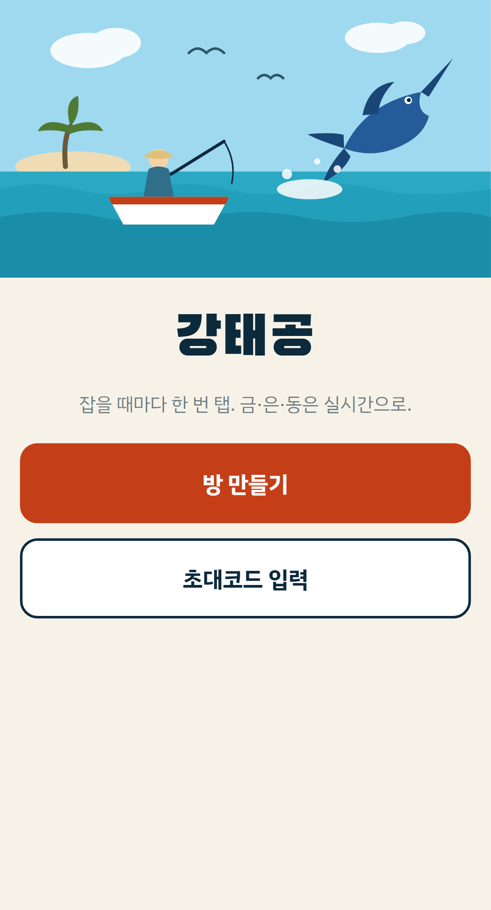

큰 버튼 두 개가 전부다 — 가입도 설치도 없다.
히어로는 전부 인라인 SVG다(이미지 파일 0개). 약한 전파에서 첫 로딩이 빨라야 하기 때문.

| | |
|---|---|
| 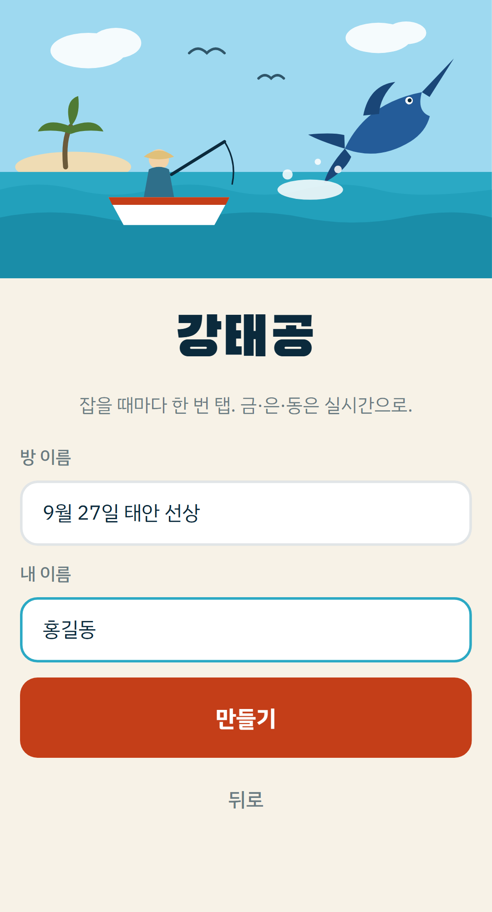 | 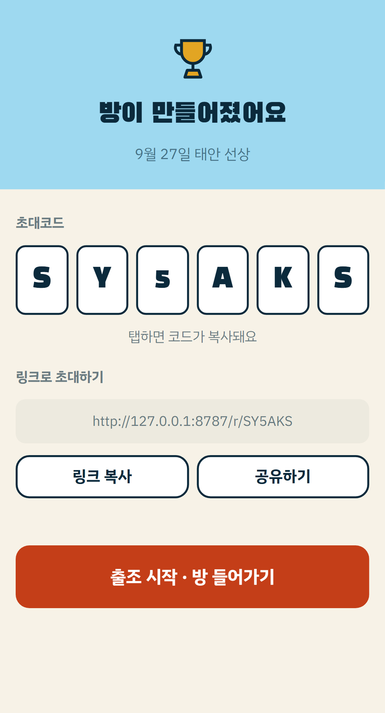 |
| 방 이름 + 내 이름만 받는다 | ② 초대코드 6자리 (0·O·1·I 제외) |

> ② 화면의 QR 카드는 2026-09-21 보류 결정. 코드 타일 + 링크 공유로 대체했다.

---

## ③ 입장

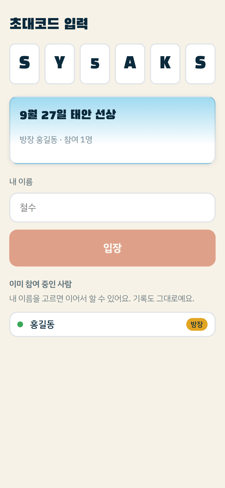

링크로 열면 코드가 자동으로 채워진다.
아래 "이미 참여 중인 사람"에서 내 이름을 고르면 저장소가 날아가도 이어서 할 수 있다(PIN 없음).

---

## ④ 조과 화면 — 메인

| | |
|---|---|
| 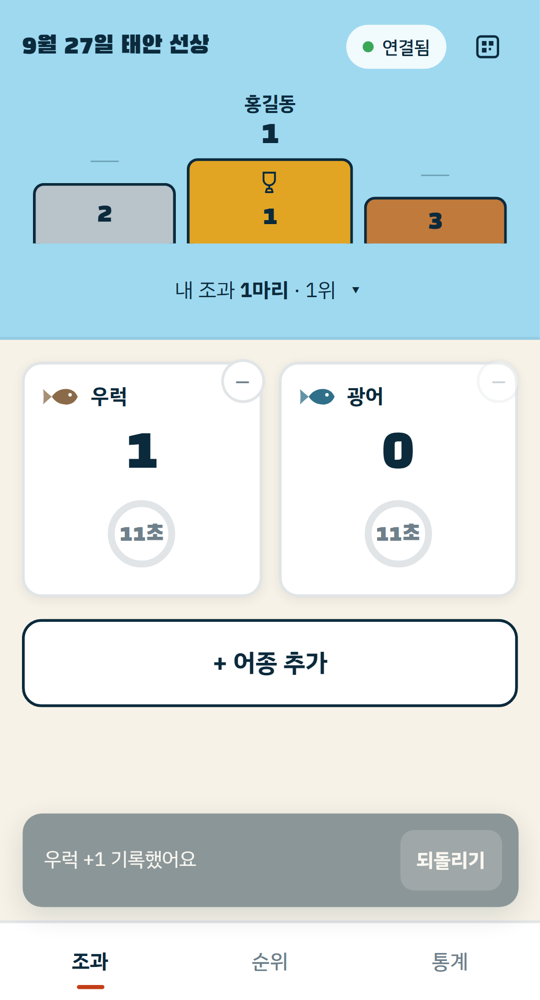 | 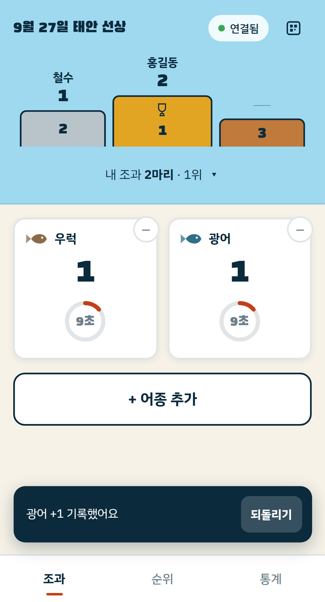 |
| +1 직후: 10초 원형 게이지 + 되돌리기 스낵바 | 두 카드 모두 게이지가 돈다 |

오른쪽 화면이 **쿨다운이 사람 단위**임을 보여준다 — 우럭을 눌렀는데 광어 카드도 같이 잠긴다.
어종을 잘못 눌렀을 때는 되돌리기를 누르면 쿨다운이 **즉시 풀려** 바로 고쳐 누를 수 있다.

포디움은 은(왼) · 금(가운데) · 동(오른쪽). 수상자가 없는 자리는 `—`로 남긴다.

---

## ⑧ 전체 순위

| 방장 시점 | 일반 참여자 시점 |
|---|---|
| 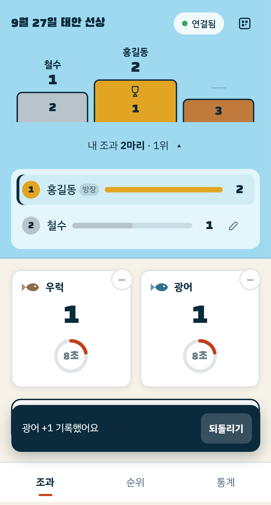 | 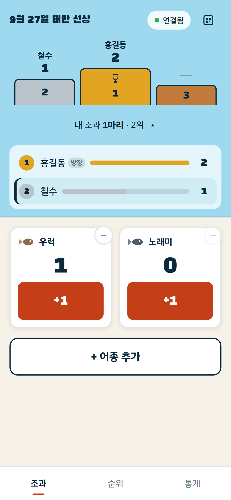 |

방장에게만 각 행 오른쪽에 **연필 버튼(대신 입력)** 이 보인다. 본인 행에는 없다.
일반 참여자에게는 버튼이 **렌더 자체가 되지 않고**, 서버도 `forMemberId`를 거부한다.

동점이면 "공동" 배지가 붙는다(Check 단계에서 `sr-only` → 실제 보이도록 수정).

---

## ⑨ 어종 추가 + 카드 관리

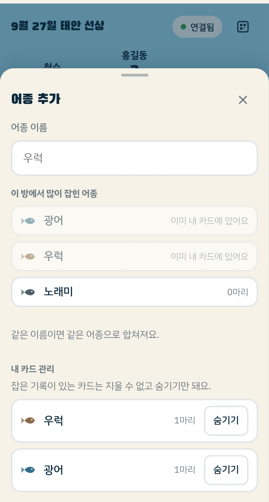

방 사전을 자동완성으로 먼저 보여준다 — "우럭 / 우 럭 / 조피볼락"으로 표기가 갈리면 통계가 깨진다.
같은 이름이면 서버가 기존 어종에 합친다.

아래 **"내 카드 관리"** 는 Check 단계에서 추가했다. 0마리 카드는 삭제, 기록이 있으면 숨기기만 된다.
조과 카드에 삭제 버튼을 더하면 젖은 손 오터치가 늘어나므로 관리는 이 시트에 모았다.

---

## ⑤ 방 정보 시트

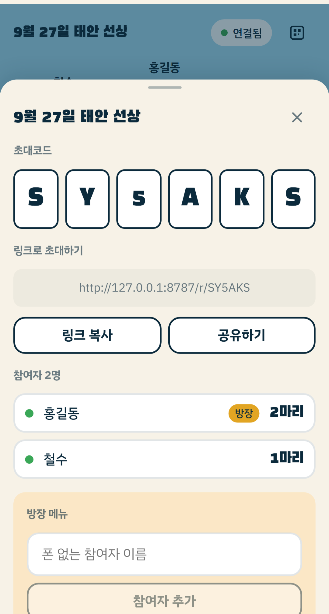

초록 점 = 지금 접속 중. **이 점이 Check 단계에서 고친 것이다** — 그 전에는 `online={false}`로
하드코딩돼 전원 회색이었다(서버는 값을 제대로 보내고 있었는데 클라이언트가 버렸다).

방장 메뉴는 호박색으로 구분하고, 일반 참여자에게는 섹션 자체가 렌더되지 않는다.
맨 아래 "마지막 활동 후 7일 뒤 자동 삭제" 안내가 개인정보 고지를 대신한다.

---

## ⑦ 방장 대리 입력

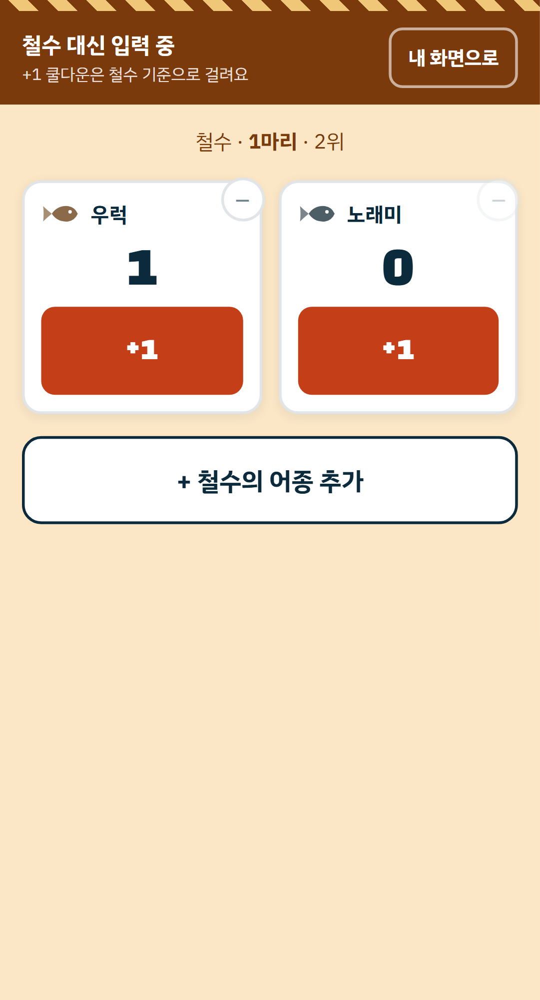

호박색 배경 + 경고 줄무늬 + 상단 배너로 내 화면과 확실히 구분한다.
엉뚱한 사람에게 입력하는 게 가장 나쁜 실패라서 색부터 바꿨다.

**쿨다운은 대상자 기준**이다. 방장이 대신 누른 직후 대상자가 모르고 또 누르는
중복 입력을 쿨다운이 자연스럽게 막아준다.

---

## ⑥ 통계

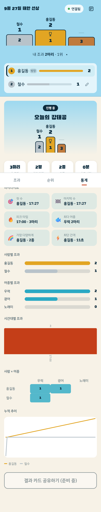

진행 중에도 볼 수 있다(종료 전용이 아님). 차트는 전부 인라인 SVG — 라이브러리 0개.

> ⚠️ **이 화면에 알려진 레이아웃 문제가 있다.** 상단에 조과 헤더(포디움+순위)가 그대로 남아
> "오늘의 강태공" 포디움과 중복되고, 시간대별 막대가 버킷이 적을 때 화면 폭을 다 차지한다.
> 원인과 수정안은 [`../NEXT.md` §1](../NEXT.md) 참고.
